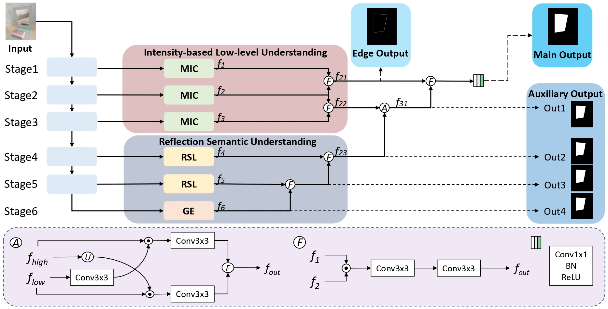

# Efficient Mirror Detection via Multi-level Heterogeneous Learning (AAAI23, ORAL)
> Authors: Ruozhen He, Jiaying Lin, and Rynson Lau
[[Paper Link]](https://arxiv.org/pdf/2211.15644v1.pdf)

## Dataset
- Download the PMD dataset at [here](https://drive.google.com/file/d/1xF_YLqbXRkB6JjXHgmM05mdPjlbtPmDz/view?usp=sharing) and MSD dataset at [here](https://drive.google.com/file/d/1Znw92fO6lCKfXejjSSyMyL1qtFepgjPI/view?usp=sharing).

## Experimental Results
- We provide HetNet training weights on [MSD](https://drive.google.com/file/d/1O4-_SXct-iontmm-mCkxafP5lGLz4Yut/view?usp=sharing) and [PMD](https://drive.google.com/file/d/1ZtVO-DHFvWwwKyeJJYK9UJx99cl8fVZ8/view?usp=sharing) presented in the papers.
- We provide HetNet testing maps on [MSD](https://drive.google.com/file/d/11d_VPuF9-Qkjuztt84-p5-NYZBUYcCkn/view?usp=sharing) and [PMD](https://drive.google.com/file/d/1dDyk5Uq_PYz5P23kevtdC0eQsA_W11yA/view?usp=sharing) presented in the papers.

## Code
### Pretrained weights
- The pretrained weight can be found here: [ResNeXt-101](https://drive.google.com/file/d/1B4WQj0Sn9eSFMZ8haT3pgv6Z12FhmMVe/view?usp=sharing).
- Put the downloaded weights under `./resnext/`.

### Train
- Download the dataset and pretrained model.
- Modify the path in `train.py`.
- Run `python train.py`.

### Test and Evaluate 
- Modify the path and filename.
- Run `python test.py`.
- Run `python eval.py`.
- The efficiency evaluation is supported by the [ptflops toolkit](https://pypi.org/project/ptflops/). To evaluate the FLOPs and Parameters, run `python eval_complexity.py`.
